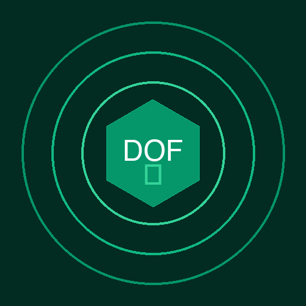

# DOF-MESH

### Despues de 5 minutos con este README, sabras exactamente como probar matematicamente que un agente de IA hizo lo que debia — y tendras el comando para hacerlo.

<p align="center">
  
  <br/>
  <strong>Matematicas, no promesas.</strong>
</p>

[](tests/)
[](core/)
[](core/)
[](core/z3_verifier.py)
[](https://snowtrace.io)
[](LICENSE)

---

## El Problema

La solucion obvia para controlar agentes autonomos de IA es usar otra IA como vigilante. Suena logico. De hecho, asi lo hacen casi todos los frameworks del mercado.

Pero es como poner a un ladron a vigilar a otro ladron.

Un LLM vigilante puede ser manipulado con el mismo prompt injection que deberia detectar. Puede alucinar que todo esta bien mientras un atacante drena un treasury. Puede ser "convencido" de ignorar una violacion. No puede probar nada — solo opinar.

Y aqui esta el near miss que nadie ve: monitorear no es gobernar. Puedes tener dashboards preciosos, alertas en Slack, logs inmutables — y aun asi tu agente puede actuar mal porque **nadie verifico matematicamente que la accion era valida ANTES de ejecutarla**.

DOF no monitorea. DOF prueba. Antes de que la accion ocurra.

---

## La Solucion

DOF-MESH es un framework de governance deterministica para agentes autonomos de IA. Cada decision de tu agente pasa por 7 capas de verificacion — **ninguna usa LLMs** — y genera una prueba matematica formal con Z3, el mismo motor que certifica sistemas de aviacion.

Esa prueba se graba inmutablemente en blockchain. Cualquier regulador, auditor o cliente puede verificarla de forma independiente.

No te pedimos que confies en nosotros. Te pedimos que verifiques.

---

## Quick Start

```bash
pip install dof-sdk==0.5.0
dof verify-states          # 4 teoremas Z3 → PROVEN
dof verify-hierarchy       # 42 patrones → PROVEN
dof health --json          # estado completo del sistema
python3 -m unittest discover -s tests   # 3,632 tests
```

---

## Como Funciona — 7 Capas, 0 LLMs

Cada accion de tu agente atraviesa estas 7 capas antes de ejecutarse. Todas son deterministas. Ninguna consume tokens. Latencia total: menos de 30ms.

| Capa | Que hace | Analogia |
|------|----------|----------|
| **1. Constitution** | Reglas duras que bloquean violaciones inmediatamente | La ley — no se negocia |
| **2. AST** | Analisis estatico del codigo generado por el agente | Inspeccion de rayos X |
| **3. Supervisor** | Meta-evaluacion: calidad, adherencia, completitud | El director de calidad |
| **4. Adversarial** | Simula ataques contra la respuesta del agente | Red team automatico |
| **5. Memory** | Detecta drift respecto al comportamiento historico | El detective que recuerda todo |
| **6. Z3** | Genera prueba matematica formal — no sampling, no heuristicas | El teorema que no se puede refutar |
| **7. Oracle** | Graba la prueba inmutablemente en blockchain | El notario digital permanente |

**Zero-LLM governance**: toda decision es deterministica (regex, AST, Z3). Un prompt injection no puede sobornar una ecuacion matematica.

---

## Numeros que Importan

| Metrica | Valor |
|---------|-------|
| Modulos core | **119** |
| Tests automatizados | **3,632+** pasando |
| Lineas de codigo | **~115,000** |
| Teoremas Z3 probados | **4** (exhaustivos para TODOS los inputs) |
| Patrones de jerarquia verificados | **42** |
| Attestations on-chain | **21** en mainnet |
| Chains soportadas | **5** (Avalanche, Base, Celo, ETH, Tempo) |
| Capas de governance | **7** (0 usan LLMs) |
| Checks Sentinel | **10** |
| Dimensiones TRACER | **6** |
| Falsos positivos | **0%** |
| Agente autonomo: ciclos sin intervencion | **238** |

> **La sorpresa:** 3,632 tests. Cero dependen de otro LLM para governance. En un mundo donde todos usan IA para vigilar IA, DOF usa matematicas.

---

## Diferenciador

| | **DOF-MESH** | **Otros Frameworks** |
|---|---|---|
| Metodo de verificacion | Z3 formal (exhaustivo) | LLM-based (probabilistico) |
| Falsos positivos | 0% | Variable |
| Manipulable por prompt injection | No | Si |
| Pruebas on-chain | Si (5 chains) | No |
| Latencia por verificacion | <30ms | 2-5 segundos |
| Dependencia de LLM para governance | Cero | Total |
| Prueba auditable por terceros | Si (blockchain publica) | No |

---

## Deployado en Produccion

DOF no es un prototipo. Ya opera en produccion con attestations verificables.

**Chains activas:**
- **Avalanche C-Chain** — ERC-8004 Identity: `0x8004A169FB4a3325136EB29fA0ceB6D2e539a432`
- **Avalanche C-Chain** — Reputation Registry: `0x8004B663056A597Dffe9eCcC1965A193B7388713`
- **Tempo Network (Stripe)** — Identity: `0x94e8Ed614...` | Reputation: `0x432E2ab9d...`
- **Base, Celo, ETH** — Multi-chain attestation support

**Agente #1 verificado:** Apex Arbitrage Agent (#1687) — 238 ciclos autonomos, 21 attestations on-chain, Sentinel 10/10.

---

## SDK

```bash
pip install dof-sdk==0.5.0
```

```python
from dof import DOFVerifier

verifier = DOFVerifier()

# Verificar una accion de agente antes de ejecutarla
result = verifier.verify_action(
    agent_id="apex-1687",
    action="transfer",
    params={"amount": 500, "token": "USDC"}
)

print(result.verdict)       # APPROVED | REJECTED | TIMEOUT
print(result.z3_proof)      # prueba formal completa
print(result.attestation)   # tx hash on-chain
```

**Extras del SDK:**
- Self-improvement engine (inspirado en MiniMax M2.7)
- Supply Chain Guard (proteccion contra TeamPCP, Glassworm)
- Sentinel: 10 checks automatizados
- TRACER: 6 dimensiones de evaluacion

---

## Documentacion

| Documento | Que encontraras |
|-----------|-----------------|
| [INDEX.md](docs/INDEX.md) | Mapa completo de la documentacion |
| [Arquitectura](docs/ARCHITECTURAL_REDESIGN_v1.md) | Diseno de las 7 capas |
| [Competition Bible](docs/COMPETITION_BIBLE.md) | Contexto competitivo y diferenciadores |
| [Winston Framework](docs/WINSTON_COMMUNICATION_FRAMEWORK.md) | Framework de comunicacion del proyecto |
| [Monetization](docs/DOF_MONETIZATION_STRATEGY.md) | Modelo GDP: Free → Pro → Enterprise |
| [Changelog](CHANGELOG.md) | Historial completo de versiones |

---

## Lo que te llevas

Antes de leer este README, la unica forma de saber si tu agente se porto bien era confiar en logs que el mismo agente genero. Ahora sabes que existe una alternativa:

- **Prueba matematica** — no estadistica, no heuristica. Z3 prueba para TODOS los inputs posibles.
- **Inmutable** — grabada en blockchain publica. No se puede borrar, editar ni ocultar.
- **Verificable por terceros** — cualquier regulador, auditor o cliente puede auditarla independientemente.
- **Sin dependencia de LLMs** — un prompt injection no puede sobornar una ecuacion.
- **30 segundos para empezar** — `pip install dof-sdk`.

La pregunta no es si necesitas governance verificable para tus agentes. La pregunta es cuanto te va a costar no tenerla.

```bash
pip install dof-sdk==0.5.0
```

**Si tu agente maneja dinero, demuestra que no robo. Con matematicas.**

---

<p align="center">
  <strong>DOF-MESH</strong> · Deterministic Observability Framework<br/>
  <em>Matematicas, no promesas.</em><br/><br/>
  Cyber Paisa — Enigma Group — Medellin, Colombia<br/>
  BSL-1.1 · <a href="LICENSE">License</a>
</p>
