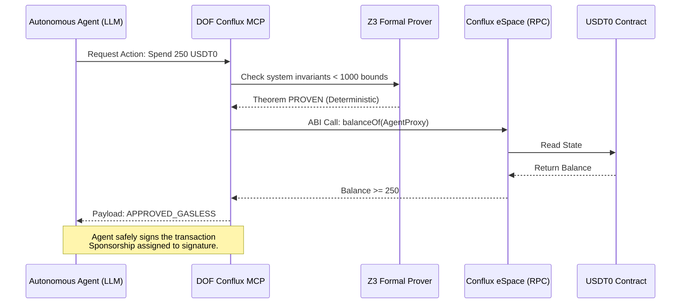

# DOF-MESH × Conflux — Global Hackfest 2026

<div align="center">


[](https://github.com/conflux-fans/global-hackfest-2026)

**Deterministic governance for autonomous AI agents — provably correct, on-chain verified.**

[dofmesh.com](https://dofmesh.com) · [Demo Video](https://youtu.be/WwpqXdYYID8) · [Live Contract](#live-on-conflux) · [Quick Start](#quick-start) · [Architecture](#architecture) · [Verify It Yourself](#verify-it-yourself)

</div>

---

> **Demo Video:** [https://youtu.be/WwpqXdYYID8](https://youtu.be/WwpqXdYYID8)  
> **Live Docs:** [https://dofmesh.com](https://dofmesh.com)

---

## Overview

DOF-MESH is the first framework that **mathematically proves** autonomous AI agents behaved correctly — before they act. It uses Z3 formal verification, deterministic governance, and on-chain attestation to produce tamper-proof compliance records. No LLM judges the decision. No trust required. The proof is on-chain.

Conflux eSpace hosts our live `DOFProofRegistry` contract. We use Conflux's native **Gas Sponsorship** so agents pay zero gas to register compliance proofs — a feature critical for autonomous agent infrastructure.

---

## 🏆 Hackathon Information

- **Event**: Global Hackfest 2026
- **Focus Area**: Open Innovation — AI × Blockchain infrastructure
- **Team**: Cyber Paisa (solo)
- **Submission Date**: 2026-04-20 @ 11:59:59

---

## Hackfest 2026 — Competing Tracks

| Track | Criteria Met | Prize |
|-------|-------------|-------|
| 🤖 Best AI + Conflux | Z3 formal proofs + MCP Server + on-chain attestation + Proof-to-Gasless | $500 |
| 🔧 Best Developer Tool | First MCP Server for Conflux — 5 tools for any AI agent runtime | $500 |
| 💰 Best USDT0 Integration | Deterministic Zero-Gas validation bounds for agent spending in DeFi | $500 |
| 📦 Bounty 04 — MCP Server | `mcp_server/dof_conflux_mcp.py` · 6 tools · stdio + HTTP transport | $500 |

**Skills validated against:** [conflux-fans/conflux-skills](https://github.com/conflux-fans/conflux-skills) — all `conflux-dev`, `conflux-scan-rpc`, `conflux-docs` patterns applied.

---

## 🔌 Hackfest Extension: MCP + DeFi Synergy

We evolved DOF-MESH to operate not just as an off-chain oracle, but as a live **Model Context Protocol (MCP)** server specifically built for Conflux eSpace. Any AI agent standard (like Claude Desktop or Cursor) can inherit our mathematical governance simply by attaching the Server. 

To prove its power in **DeFi**, we integrated a deterministic on-chain liquidity boundary test for **USDT0**. The agent can only execute token transfers if DOF-MESH formally proves the limits constraints are respected and the reserves are solvent. 



---

## 👥 Team

| Name | Role | GitHub | Discord |
|------|------|--------|---------|
| Juan Carlos Quiceno | Founder · Full-Stack · Smart Contracts | [@Cyberpaisa](https://github.com/Cyberpaisa) | cyber_paisa |

---

## 🚀 Problem Statement

Autonomous AI agents act on behalf of users — executing transactions, calling APIs, making financial decisions. The current answer to "did this agent behave correctly?" is: *trust us*.

That is not an answer.

- Rules encoded as prompts can be overridden at any moment
- LLM-based validators hallucinate — a validator that can lie cannot validate
- Audit logs can be altered after the fact
- There is no cryptographic proof an agent followed its governance contract **before** it acted

The result: billions of dollars in autonomous agent activity with no verifiable compliance record.

---

## 💡 Solution

DOF-MESH verifies agent compliance **before execution** using three independent deterministic layers:

```
Agent Output
     │
     ▼
┌─────────────────────────────────────────────────────┐
│  Layer 1 — Constitution                             │
│  Deterministic HARD/SOFT rules (regex + AST)        │
│  HARD rules block. SOFT rules warn. Zero LLM.       │
└──────────────────────┬──────────────────────────────┘
                       │ PASSED
                       ▼
┌─────────────────────────────────────────────────────┐
│  Layer 2 — Z3 SMT Formal Verification               │
│  4 theorems mathematically PROVEN:                  │
│  GCR_INVARIANT · SS_FORMULA · SS_MONOTONICITY       │
│  SS_BOUNDARIES                                      │
│  Not "probably correct." PROVEN.                    │
└──────────────────────┬──────────────────────────────┘
                       │ PROVEN
                       ▼
┌─────────────────────────────────────────────────────┐
│  Layer 3 — TRACER Score                             │
│  Multi-dimensional quality: Quality · Accuracy      │
│  Compliance · Format · Communication                │
└──────────────────────┬──────────────────────────────┘
                       │ SCORED
                       ▼
┌─────────────────────────────────────────────────────┐
│  Proof Hash (keccak256 of full payload)             │
│  → Published on-chain via DOFProofRegistry          │
│  → Conflux eSpace Testnet (chain ID 71)             │
└─────────────────────────────────────────────────────┘
```

The result: a tamper-proof, on-chain record that a specific agent output passed formal governance verification — before any action was taken.

---

## Go-to-Market Plan

**Who it's for:**
- AI agent developers who need verifiable compliance for regulated industries (finance, healthcare, legal)
- Blockchain protocols that want provably-correct agents managing treasuries or DAOs
- Enterprises deploying autonomous AI that must audit agent behavior at scale

**Why they'll use it:**
- The only system that produces cryptographic proof of agent compliance — not logs, not promises
- Zero-LLM governance: deterministic, reproducible, auditable
- Gas Sponsorship on Conflux removes the operational burden of gas management for agents

**How we acquire users:**
- SDK on PyPI (`pip install dof-sdk`) — developers adopt the framework, Conflux integration comes free
- Conflux ecosystem: pitch to DeFi protocols needing auditable AI agents for treasury management
- ERC-8004 standard (Autonomous Agent Identity) already submitted to Ethereum Magicians — creates network effects as the identity layer that DOF-MESH verifies

**Key metrics:**
- Attestations on-chain (currently 80+ across 8 chains, 38+ on Conflux Testnet)
- Active agent cycles under governance (238+ completed)
- Chains supported (8 currently, targeting Conflux Core Space + mainnet next)

**How it fits Conflux:**
Conflux Gas Sponsorship is uniquely suited for AI agent infrastructure. Agents should not hold gas — they should act. DOF-MESH + Conflux Sponsorship creates the first zero-friction, provably-correct agent compliance layer on any chain.

---

## ⚡ Conflux Integration

- [x] **eSpace** — DOFProofRegistry deployed at `0x554cCa8ceBE30dF95CeeFfFBB9ede5bA7C7A9B83` on Conflux eSpace Testnet (chain ID 71). 38+ proofs registered, 2 verified TXs from hackathon demo.
- [x] **Gas Sponsorship** — `SponsorWhitelistControl` at `0x0888000000000000000000000000000000000001` integrated in `ConfluxGateway`. Agents pay zero gas to register compliance proofs. Code in `core/adapters/conflux_gateway.py`.
- [x] **Built-in Contracts** — `SponsorWhitelistControl` for gas sponsorship of agent proof registration
- [ ] **Core Space** — Planned: governance verification in Core Space for higher throughput
- [ ] **Cross-Space Bridge** — Planned: cross-space proof synchronization

### What makes Conflux the right chain for AI governance

Gas Sponsorship is not a nice-to-have — it is architecturally necessary. An autonomous agent registering compliance proofs every cycle cannot be expected to hold CFX. With Conflux, the protocol operator sponsors gas and the agent operates friction-free. No other EVM chain has this natively.

---

## ✨ Features

### Core Features
- **Zero-LLM Governance** — every decision is deterministic (regex, AST analysis, Z3 SMT)
- **Z3 Formal Proofs** — 4 invariants mathematically PROVEN for all possible inputs, not just tested cases
- **On-Chain Attestation** — keccak256 proof hash published to Conflux Testnet via `DOFProofRegistry`
- **ConfluxGateway** — purpose-built adapter with Gas Sponsorship integration
- **7-Layer Stack** — Constitution → AST → Tool Hook PRE → Supervisor → Adversarial → Memory → Z3

### Advanced Features
- **Multi-Chain** — identical `DOFProofRegistry` contract on 8 chains (3 mainnet + 5 testnet)
- **238+ Autonomous Cycles** — agent self-governance without human intervention, all attested
- **TRACER Score** — 5-dimensional quality scoring (Quality, Accuracy, Compliance, Format, Communication)
- **A2A Server** — JSON-RPC + REST API for agent-to-agent governance delegation (port 8000)
- **dof-sdk on PyPI** — installable SDK so any developer can add DOF governance in 3 lines

### Roadmap (post-hackathon)
- **Conflux Core Space** — governance verification with higher throughput
- **Gas Sponsorship automation** — automatic whitelist management for agent fleets
- **Conflux Mainnet deployment** — production-grade proof registry
- **Cross-Space proof sync** — governance proofs accessible from both Core and eSpace
- **ERC-8004 + DOF bundled** — agent identity + compliance in a single on-chain record

---

## 🛠️ Technology Stack

### Backend
- **Runtime**: Python 3.12
- **Framework**: CrewAI (multi-agent orchestration)
- **Formal Verification**: Z3 SMT Solver (Microsoft Research)
- **APIs**: A2A Server (JSON-RPC + REST)
- **Database**: JSONL audit logs + PostgreSQL (production)

### Blockchain
- **Network**: Conflux eSpace Testnet (chain 71) + 7 other EVM chains
- **Smart Contracts**: Solidity — `DOFProofRegistry.sol`
- **Development**: Hardhat
- **Web3**: web3.py v7.x
- **Gas Sponsorship**: Conflux `SponsorWhitelistControl` (built-in contract)

### Frontend / Docs
- **Dashboard**: Next.js 16.2 + React 19 + Tailwind CSS
- **Docs**: Mintlify (23 pages live at [dofmesh.com](https://dofmesh.com))

### Infrastructure
- **SDK**: PyPI (`dof-sdk v0.6.0`)
- **CI**: GitHub Actions (Tests + Z3 verification + Lint)
- **Agent Identity**: ERC-8004 on Avalanche C-Chain

---

## 🏗️ Architecture

DOF-MESH has 7 governance layers. The Conflux integration sits at layer 7 — the output of the full stack:

```
Interfaces  ──  CLI · A2A Server (port 8000) · Telegram · Dashboard
                              │
                    ┌─────────┴─────────┐
                    │   7-Layer Stack   │
                    │                  │
                    │  1. Constitution  │  ← HARD/SOFT rules, zero LLM
                    │  2. AST Validator │  ← static analysis of generated code
                    │  3. Tool Hook PRE │  ← intercepts before tool execution
                    │  4. Supervisor    │  ← behavioral monitoring across turns
                    │  5. Adversarial   │  ← red/blue pipeline vs injections
                    │  6. Memory Layer  │  ← reproducible session state
                    │  7. Z3 Verifier   │  ← 4/4 invariants PROVEN
                    └─────────┬─────────┘
                              │
                    ┌─────────┴─────────┐
                    │   Proof Builder   │
                    │  keccak256 hash   │
                    │  of full payload  │
                    └─────────┬─────────┘
                              │
              ┌───────────────┼───────────────┐
              ▼               ▼               ▼
         Conflux          Avalanche         Base
         Testnet          C-Chain          Mainnet
         chain 71         chain 43114      chain 8453
```

**DOFProofRegistry.sol** — identical contract deployed on all 8 chains:

```solidity
struct ProofRecord {
    bytes32 proofHash;    // governance payload fingerprint
    uint256 agentId;      // ERC-8004 token ID
    uint256 timestamp;    // block timestamp
    string  metadata;     // version + scores (human readable)
}

function registerProof(bytes32 proofHash, uint256 agentId, string calldata metadata) external;
function verifyProof(bytes32 proofHash) external view returns (bool);
function getProof(bytes32 proofHash) external view returns (ProofRecord memory);
function getProofCount() external view returns (uint256);
```

---

## Live on Conflux

**DOFProofRegistry** — deployed and verified:

| | |
|---|---|
| **Contract** | [`0x554cCa8ceBE30dF95CeeFfFBB9ede5bA7C7A9B83`](https://evmtestnet.confluxscan.io/address/0x554cCa8ceBE30dF95CeeFfFBB9ede5bA7C7A9B83) |
| **Chain** | Conflux eSpace Testnet — Chain ID 71 |
| **Proofs registered** | 38+ |
| **Wallet** | `0xEAFdc9C3019fC80620f16c30313E3B663248A655` |

### Verified transactions

| Date | TX Hash | What it proves |
|---|---|---|
| Apr 6, 2026 | [`bf98ea58...bebf740c`](https://evmtestnet.confluxscan.io/tx/bf98ea58265dcd8433f594376d0d679fde65d93ae8cc18d841627308bebf740c) | Full 6-step governance cycle — Agent #1687 |
| Apr 6, 2026 | [`77d4ddea...b12465e5`](https://evmtestnet.confluxscan.io/tx/77d4ddea0043bf6df5a916cd7040886e0a97480ab12465e5842ce7c2f26b4b10) | Direct attestation test |

Every TX contains a `proof_hash` — the keccak256 fingerprint of the complete governance payload (agent ID, Z3 results, TRACER score, timestamp). Immutable. Auditable. Independent of DOF-MESH infrastructure.

---

## Quick Start

```bash
git clone https://github.com/Cyberpaisa/DOF-MESH
cd DOF-MESH
pip install -r requirements.txt

# Run the full 6-step governance cycle (dry-run, no wallet needed)
python3 scripts/conflux_demo.py --dry-run

# Run with real on-chain attestation (requires CONFLUX_PRIVATE_KEY in .env)
python3 scripts/conflux_demo.py

# Run the Conflux test suite
python3 -m unittest tests.test_conflux_gateway tests.test_conflux_integration -v
```

**Expected output:**
```
Constitution:     ✅ PASSED  (score=1.0000)
Z3 Verification:  ✅ 4/4 PROVEN  (44ms)
TRACER Score:     ✅ 0.504/1.0
Proof Hash:       0x...
Attestation:      CONFIRMED
TX Hash:          bf98ea58...
Verify at:        https://evmtestnet.confluxscan.io/tx/...
```

### Environment Configuration

```env
CONFLUX_PRIVATE_KEY=your_private_key_here
CONFLUX_RPC_URL=https://evmtestnet.confluxrpc.com
CONFLUX_CHAIN_ID=71
```

---

## Conflux Integration — Code

### ConfluxGateway

`core/adapters/conflux_gateway.py` — purpose-built for Conflux eSpace:

```python
from core.adapters.conflux_gateway import ConfluxGateway

# Connect — testnet
gw = ConfluxGateway(use_testnet=True, dry_run=False)
print(gw.w3.eth.chain_id)  # 71

# Access Gas Sponsorship
sponsor = gw.get_sponsor_contract()
# → SponsorWhitelistControl at 0x0888...0001

# The DOFProofRegistry address
print(ConfluxGateway.PROOF_REGISTRY_TESTNET)
# → 0x554cCa8ceBE30dF95CeeFfFBB9ede5bA7C7A9B83
```

### Chain Adapter

```python
from core.chain_adapter import DOFChainAdapter

# One-line connection to Conflux
adapter = DOFChainAdapter.from_chain_name("conflux_testnet")

# Publish a governance proof on-chain
result = adapter.publish_attestation(
    proof_hash="0x...",       # keccak256 of governance payload
    agent_id=1687,            # ERC-8004 agent token ID
    metadata="dof-v0.6.0 z3=4/4 tracer=0.504"
)
# → {"tx_hash": "0x...", "chain_id": 71, "gas_used": 373421}
```

---

## The Formal Proofs

Z3 is an SMT solver from Microsoft Research. DOF-MESH uses it to mathematically prove four invariants hold for every governance state:

| Theorem | What it proves |
|---|---|
| `GCR_INVARIANT` | Governance Compliance Rate is always exactly 1.0 when all rules pass |
| `SS_FORMULA` | Supervisor Score formula is correctly bounded given its inputs |
| `SS_MONOTONICITY` | Higher-quality outputs always produce higher scores (monotonic) |
| `SS_BOUNDARIES` | Score is always in [0.0, 1.0] — no overflow, no negative |

These are not unit tests. They are mathematical proofs that hold for **all possible inputs**, not just the ones you tested.

```bash
python3 -m dof verify-states
# GCR_INVARIANT:   VERIFIED  (25ms)
# SS_FORMULA:      VERIFIED   (2ms)
# SS_MONOTONICITY: VERIFIED   (9ms)
# SS_BOUNDARIES:   VERIFIED   (1ms)
# Result: 4/4 PROVEN
```

---

## Verify It Yourself

Everything claimed here is independently verifiable:

**On-chain** — no DOF-MESH software required:
```bash
# Read proof count from DOFProofRegistry (Conflux Testnet)
cast call 0x554cCa8ceBE30dF95CeeFfFBB9ede5bA7C7A9B83 \
  "getProofCount()(uint256)" \
  --rpc-url https://evmtestnet.confluxrpc.com

# Verify a specific proof hash exists
cast call 0x554cCa8ceBE30dF95CeeFfFBB9ede5bA7C7A9B83 \
  "verifyProof(bytes32)(bool)" \
  0xb8677b595b7b71f75800000000000000000000000000000000000010a9235d00 \
  --rpc-url https://evmtestnet.confluxrpc.com
```

**Locally** — clone and run:
```bash
# All tests
python3 -m unittest discover -s tests        # 4,308 tests, 0 failures

# Z3 proofs
python3 -m dof verify-states                 # 4/4 PROVEN

# Conflux-specific
python3 -m unittest tests.test_conflux_gateway tests.test_conflux_integration -v

# Full demo with real TX
python3 scripts/conflux_demo.py              # requires CONFLUX_PRIVATE_KEY in .env
```

---

## 🎬 Demo

### Demo Video
- **YouTube**: [https://youtu.be/WwpqXdYYID8](https://youtu.be/WwpqXdYYID8)
- **Duration**: 104 seconds

### Personal Intro Video
- **YouTube**: [https://youtu.be/JCVOWVA1whI](https://youtu.be/JCVOWVA1whI)
- Juan Carlos Quiceno — Medellín, Colombia — Global Hackfest 2026

### Live Resources
- **Docs**: [https://dofmesh.com](https://dofmesh.com)
- **Contract on Conflux Testnet**: [ConfluxScan](https://evmtestnet.confluxscan.io/address/0x554cCa8ceBE30dF95CeeFfFBB9ede5bA7C7A9B83)
- **GitHub**: [github.com/Cyberpaisa/DOF-MESH](https://github.com/Cyberpaisa/DOF-MESH)

### Autonomous Agent Demo

The demo registers a governance proof for Agent #1687 — a real autonomous agent that has completed 238+ cycles under DOF-MESH supervision:

```
Agent: DOF-1687
Task:  Evaluate governance compliance before executing DeFi transaction on Conflux

Step 1 — Constitution:     4/4 rules PASSED (score 1.0000)
Step 2 — Z3 Verification:  4/4 theorems PROVEN in 44ms
Step 3 — TRACER Score:     0.504/1.0
Step 4 — Proof Hash:       0xb8677b595b7b71f758... (keccak256 of full payload)
Step 5 — Conflux TX:       CONFIRMED — bf98ea58...bebf740c
Step 6 — Verifiable at:    https://evmtestnet.confluxscan.io/tx/bf98ea58...
```

**The agent acted. The math proved it. The blockchain recorded it. On Conflux.**

---

## 📄 Smart Contracts

### Deployed Contracts

#### Conflux eSpace Testnet
| Contract | Address | Explorer |
|----------|---------|----------|
| DOFProofRegistry | `0x554cCa8ceBE30dF95CeeFfFBB9ede5bA7C7A9B83` | [View on ConfluxScan](https://evmtestnet.confluxscan.io/address/0x554cCa8ceBE30dF95CeeFfFBB9ede5bA7C7A9B83) |

#### All Chains
| Chain | Address |
|-------|---------|
| Conflux Testnet (71) | `0x554cCa8ceBE30dF95CeeFfFBB9ede5bA7C7A9B83` |
| Avalanche C-Chain (43114) | `0x154a3F49a9d28FeCC1f6Db7573303F4D809A26F6` |
| Base Mainnet (8453) | `0x4e54634d0E12f2Fa585B6523fB21C7d8AaFC881D` |
| Celo Mainnet (42220) | `0x35B320A06DaBe2D83B8D39D242F10c6455cd809E` |
| Avalanche Fuji (43113) | `0x0b65d10FEcE517c3B6c6339CdE30fF4A8363751c` |
| Base Sepolia (84532) | `0x7e0f0D0bC09D14Fa6C1F79ab7C0EF05b5e4F1f59` |
| Polygon Amoy (80002) | `0x0b65d10FEcE517c3B6c6339CdE30fF4A8363751c` |
| SKALE Base Sepolia | `0x4e54634d0E12f2Fa585B6523fB21C7d8AaFC881D` |

---

## Metrics

Real numbers, independently verifiable:

| Metric | Value |
|---|---|
| Autonomous agent cycles completed | 238+ |
| Z3 formal theorems proven | 4/4 |
| On-chain attestations (Conflux testnet) | 38+ |
| On-chain attestations (all chains) | 80+ |
| Active chains | 8 (3 mainnet + 5 testnet) |
| Tests passing | 4,308 |
| LLM calls in governance path | 0 |
| Governance decision time (Z3) | ~44ms avg |
| Code base | 57K+ LOC, 142 modules |

---

## Project Structure

```
DOF-MESH/
├── core/
│   ├── adapters/
│   │   └── conflux_gateway.py     ← Conflux eSpace connection + Gas Sponsorship
│   ├── governance.py              ← Constitution: HARD/SOFT rules
│   ├── z3_verifier.py             ← Z3 SMT formal verification
│   ├── supervisor.py              ← TRACER scoring
│   ├── chain_adapter.py           ← Multi-chain attestation publisher
│   └── chains_config.json         ← Chain registry (incl. Conflux testnet)
├── scripts/
│   └── conflux_demo.py            ← 6-step demo script
├── tests/
│   ├── test_conflux_gateway.py    ← 5 gateway tests
│   └── test_conflux_integration.py ← 4 integration tests (incl. full cycle)
├── contracts/
│   └── DOFProofRegistry.sol       ← On-chain proof registry
└── docs/
    └── 04_strategy/
        └── CONFLUX_README.md      ← Extended judges reference
```

---

## 🗺️ Roadmap

### Phase 1 — Hackathon (Apr 2026) ✅
- [x] DOFProofRegistry deployed on Conflux eSpace Testnet
- [x] ConfluxGateway with Gas Sponsorship integration
- [x] 38+ on-chain proofs registered
- [x] Full 6-step governance demo with verified TXs
- [x] Z3 formal proofs: 4/4 PROVEN
- [x] 4,308 tests passing
- [x] dof-sdk v0.6.0 on PyPI

### Phase 2 — Conflux Production (Q2 2026)
- [ ] Conflux eSpace Mainnet deployment
- [ ] Gas Sponsorship automation for agent fleets
- [ ] Conflux Core Space integration (higher throughput)
- [ ] Cross-Space bridge for proof synchronization

### Phase 3 — Ecosystem (Q3-Q4 2026)
- [ ] ERC-8004 + DOF compliance bundle (identity + proof in one record)
- [ ] Conflux DeFi integrations (treasury governance for DAOs)
- [ ] Mobile SDK for agent monitoring
- [ ] Governance-as-a-Service API

---

## 🔒 Security

- **Zero-LLM governance**: every decision is deterministic — no hallucinations possible
- **Z3 formal proofs**: invariants hold for all possible inputs, mathematically
- **On-chain immutability**: proof hashes on Conflux are permanent and unalterable
- **Pre-commit security hooks**: private keys and API keys blocked from commits
- **Pre-push safety**: workers cannot push — only authorized operator

---

## 🤝 Contributing

```bash
git clone https://github.com/Cyberpaisa/DOF-MESH
cd DOF-MESH
pip install -r requirements.txt
python3 -m unittest discover -s tests   # all 4,308 tests must pass
```

Issues and PRs welcome. Governance changes require all Z3 proofs to remain PROVEN.

---

## 📄 License

Smart contracts: BSL-1.1  
Documentation: CC0

---

## 📞 Contact

- **GitHub**: [@Cyberpaisa](https://github.com/Cyberpaisa)
- **X/Twitter**: [@Cyber_paisa](https://x.com/Cyber_paisa)
- **Docs**: [dofmesh.com](https://dofmesh.com)
- **ERC-8004 proposal**: [ethereum-magicians.org/t/erc-formal-governance-proof-registry/28152](https://ethereum-magicians.org/t/erc-formal-governance-proof-registry/28152)
- **Issues**: [github.com/Cyberpaisa/DOF-MESH/issues](https://github.com/Cyberpaisa/DOF-MESH/issues)

---

## 🙏 Acknowledgments

- **Conflux Network** — for hosting Global Hackfest 2026 and the Gas Sponsorship primitive that makes agent infrastructure viable
- **Z3 (Microsoft Research)** — the SMT solver that powers DOF's formal verification
- **CrewAI** — multi-agent orchestration framework
- **Anthropic** — Claude Code, the AI development environment used throughout this project

---

<div align="center">

*Built by [Cyber Paisa](https://github.com/Cyberpaisa) — Enigma Group, Medellín, Colombia*

**"The majority of frameworks verify what happened. DOF verifies what is about to happen."**

Built with ❤️ for Global Hackfest 2026

</div>
