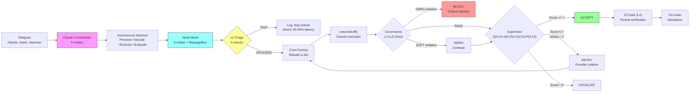
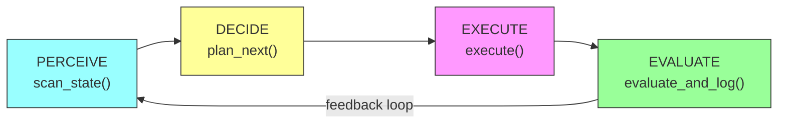
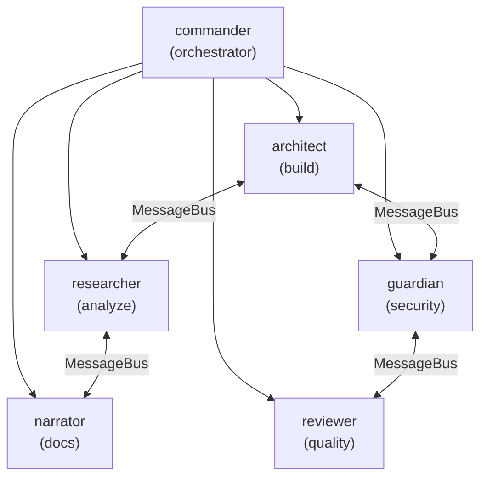
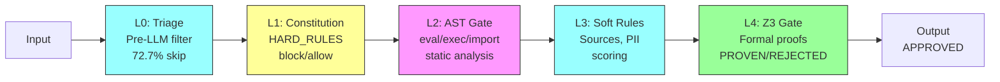

# INFORME COMPLETO DEL SISTEMA DOF v0.6

> **Fecha**: 22 de marzo de 2026
> **Autor**: Juan Carlos Quiceno Vasquez (Cyber Paisa)
> **Branch**: `main` | **Commits**: 210+ | **Version**: v0.6.0 -- Commander & Mesh Sprint
> **Anterior**: [SYSTEM_REPORT_v0.5.md](SYSTEM_REPORT_v0.5.md)

---

## 1. Resumen Ejecutivo

**Deterministic Observability Framework (DOF)** es un framework de orquestacion y observabilidad deterministica para sistemas multi-agente LLM bajo restricciones de infraestructura adversarial.

Reemplaza la confianza probabilistica por **pruebas formales verificables con Z3**, registrando cada decision on-chain (Avalanche C-Chain + Conflux). Gobernanza **Zero-LLM**: funciones puras en Python para reglas de cumplimiento -- cero alucinaciones, cero inyeccion de prompts en la capa de seguridad.

**v0.6 marca la transicion de DOF de framework de observabilidad a sistema autonomo completo**: Claude Commander controla agentes Claude Code directamente, el Autonomous Daemon opera 24/7 sin intervencion humana, y el Node Mesh conecta 6 nodos con sesiones persistentes de memoria infinita. Se registro como agente #1617 en Society AI.

### Numeros Clave

| Metrica | v0.5 | v0.6 | Delta |
|---------|------|------|-------|
| **Core modules** | 45 | 52+ | +7 |
| **Mesh nodes** | 0 | 6 | +6 |
| **Messages exchanged** | 0 | 41+ | +41 |
| **Commander modes** | 0 | 5 | +5 |
| **Daemon types** | 0 | 3 | +3 |
| **Security layers** | -- | L0-L4 | NEW |
| **Society AI Agent** | -- | #1617 | NEW |
| **Book chapters** | 0 | 4 | +4 |
| **Lineas de codigo** | 860K+ | 860K+ | = |
| **Agentes especializados** | 12 | 12 | = |
| **A2A Skills** | 11 | 11 | = |
| **Git commits** | 199 | 210+ | +11 |
| **Z3 Theorems** | 8/8 PROVEN | 8/8 PROVEN | = |
| **On-chain attestations** | 48+ | 48+ | = |
| **Proveedores LLM** | 7 | 7 | = |
| **Smart contracts** | 3 | 3 | = |
| **Baseline dof_score** | 0.8117 | 0.8117 | = |
| **Revenue tracked** | $1,134.50 | $1,134.50 | = |
| **L0 Triage skip rate** | 72.7% | 72.7% | = |
| **Tests** | 986 | 986 | = |

---

## 2. Arquitectura General v0.6

```mermaid
flowchart TD
    subgraph Interfaces["Interfaces de Usuario"]
        CLI["CLI Interactivo<br/>main.py"]
        A2A["A2A Server<br/>Puerto 8000"]
        MCP["MCP Server<br/>Claude Desktop/Cursor"]
        TG["Telegram Bot<br/>@clude_dof_bot"]
        DASH["Streamlit Dashboard<br/>Puerto 8501"]
        CHAN["Telegram Channels<br/>Claude Plugin"]
    end

    subgraph Commander["Claude Commander -- core/claude_commander.py"]
        SDK["Mode 1: SDK<br/>Direct Agent SDK"]
        SPAWN["Mode 2: Spawn<br/>Named sub-agents"]
        TEAM["Mode 3: Team<br/>Parallel multi-agent"]
        DEBATE["Mode 4: Debate<br/>AgentMeet rooms"]
        PEERS["Mode 5: Peers<br/>P2P messaging"]
    end

    subgraph Daemon["Autonomous Daemon -- core/autonomous_daemon.py"]
        BD["BuilderDaemon<br/>180s, $3/cycle"]
        GD["GuardianDaemon<br/>300s, $2/cycle"]
        RD["ResearcherDaemon<br/>600s, $2/cycle"]
    end

    subgraph Mesh["Node Mesh -- core/node_mesh.py"]
        CMD["commander"]
        ARCN["architect"]
        RESN["researcher"]
        GUAN["guardian"]
        NARN["narrator"]
        REVN["reviewer"]
    end

    subgraph Security["Security Hierarchy (L0-L4)"]
        L0["L0: Triage<br/>Pre-LLM filter"]
        L1["L1: Constitution<br/>HARD_RULES"]
        L2["L2: AST Gate<br/>Static analysis"]
        L3["L3: Soft Rules<br/>Scoring"]
        L4["L4: Z3 Gate<br/>Formal verification"]
    end

    subgraph Orchestration["Orquestacion -- crew_runner.py"]
        PM["Provider Manager<br/>7 LLMs + Bayesian"]
        CF["Crew Factory<br/>Rebuild por retry"]
        GOV["Constitution<br/>Enforcer"]
        SUP["Meta-Supervisor<br/>Q+A+C+F scoring"]
        CP["Checkpointing<br/>JSONL por step"]
    end

    subgraph Verification["Verificacion Formal + Security"]
        Z3["Z3 Theorem Prover<br/>8 theorems"]
        PQC["PQC Analyzer<br/>Quantum resistance"]
        CS["Contract Scanner<br/>Solidity vuln detection"]
        AMEM["A-Mem<br/>Zettelkasten knowledge"]
    end

    subgraph Blockchain["Blockchain & Attestations"]
        AVA["Avalanche Bridge<br/>DOFValidationRegistry"]
        ENI["Enigma Bridge<br/>Supabase trust scores"]
        SAI["Society AI<br/>Agent #1617"]
    end

    Interfaces --> Commander
    Commander --> Daemon
    Daemon --> Mesh
    Mesh --> Orchestration
    Orchestration --> Security
    Security --> Verification
    Verification --> Blockchain
```



---

## 3. Pipeline de Ejecucion v0.6



---

## 4. Nuevos Modulos v0.6 (22 de Marzo de 2026)

### 4.1 Claude Commander (`core/claude_commander.py`)

**Proposito**: DOF ordena a Claude Code directamente -- 5 modos de comunicacion entre agentes. Sin API keys, sin gateway, sin overhead.

**5 Modos**:

| # | Modo | Mecanismo | Latencia | Caso de Uso |
|---|------|-----------|----------|-------------|
| 1 | **SDK** | `claude_agent_sdk.query()` directo | 7.3s (Haiku) / 20.6s (Opus) | Comandos directos |
| 2 | **Spawn** | Sub-agente nombrado con AgentDefinition | 20-60s | Agentes especializados |
| 3 | **Team** | `asyncio.gather()` ejecucion paralela | 60-120s | Code review multi-agente |
| 4 | **Debate** | Salas AgentMeet HTTP, multi-ronda | 90-180s | Decisiones de arquitectura |
| 5 | **Peers** | P2P via Claude Peers MCP broker (puerto 7899) | Variable | Comunicacion entre maquinas |

**Session Persistence**:
- `persistent_command(name, prompt)` crea/retoma sesiones con nombre
- Sesiones persisten en `logs/commander/sessions.json`
- Permite **memoria infinita** a traves de ciclos del daemon

**Governance Wrapper**:
- `governed_command()` ejecuta pipeline completo: L0 Triage -> Constitution check -> Execute -> Verify output
- Bloquea prompts y outputs que violan HARD_RULES

**API**:
```python
from core.claude_commander import ClaudeCommander

commander = ClaudeCommander(
    model="claude-opus-4-6",
    max_budget_usd=100.0,
    agentmeet_url="https://www.agentmeet.net",
    peers_port=7899,
)

# Mode 1: SDK
result = await commander.command("Fix the bug in core/governance.py")
# -> CommandResult(status="success", output="...", session_id="...", elapsed_ms=20600)

# Mode 2: Spawn
result = await commander.spawn_agent(
    name="security-auditor",
    prompt="Audit core/ for vulnerabilities",
    tools=["Read", "Grep", "Glob"]
)

# Mode 3: Team
team = await commander.run_team(
    task="Review DOF v0.6 release",
    agents={
        "reviewer": "Check code quality and patterns",
        "security": "Audit for vulnerabilities",
        "tester": "Verify all tests pass",
    },
    parallel=True,
)
# -> TeamResult(status="success", results={...}, elapsed_ms=115000)

# Mode 4: Debate
debate = await commander.debate(
    room="dof-council",
    topic="Should we migrate from ChromaDB to Ori Mnemos?",
    agents=["researcher", "architect", "security"],
    rounds=3,
)
# -> DebateResult(room="dof-council", messages=[...], consensus="...")

# Mode 5: Peers
peers = await commander.list_peers()
await commander.message_peer(peer_id, "Run security scan")

# Persistent session (infinite memory)
result = await commander.persistent_command("builder", "Implement the new API")

# Governed command (full pipeline)
result = await commander.governed_command("Analyze the codebase")

# Health check
health = await commander.health_check()
# -> {"sdk": True, "peers": True, "agentmeet": True, "timestamp": "2026-03-22T..."}
```

**Defaults**: model=claude-opus-4-6, budget=$100, permission_mode=bypassPermissions
**Tested**: SDK 7.3s (Haiku), 20.6s (Opus), team 2-agent review 115s

**Telegram Commands**:
- `/claude <prompt>` -- Direct SDK command
- `/team <task>` -- Multi-agent team
- `/parallel <task>` -- Parallel execution
- `/daemon` -- Start/stop autonomous daemon
- `/multidaemon` -- Start 3 specialized daemons
- `/sessions` -- List persistent sessions
- `/approve` -- Approve daemon action
- `/redirect <comment>` -- Redirect daemon with new instructions

**Logs**: `logs/commander/commands.jsonl`, `logs/commander/sessions.json`

---

### 4.2 Autonomous Daemon (`core/autonomous_daemon.py`)

**Proposito**: El orquestador auto-gobernante -- opera 24/7 sin intervencion humana con 4 fases.

**4 Fases** (ciclo continuo):



**Perception** (scan_state):
- Pending Telegram orders (queue/*.json)
- Recent error count (ultima hora)
- Git dirty files count
- Commander health check (SDK, Peers, AgentMeet)
- Last experiment dof_score

**Decision** (plan_next) -- Motor deterministico, ZERO LLM:

| Prioridad | Trigger | Modo | Accion |
|-----------|---------|------|--------|
| P1 | pending_orders > 0 | BUILD | Execute Telegram orders |
| P2 | recent_errors >= 3 | PATROL | Diagnose errors |
| P3 | git_dirty > 5 | REVIEW | Code review changes |
| P4 | cycle % 5 == 0 | IMPROVE | Autoresearch optimization |
| P5 | cycle % 10 == 0 | REPORT | Status report |
| P5 | default | PATROL | Routine health monitoring |

**3 Daemons Especializados** (modo `--multi`):

| Daemon | Ciclo | Budget | Especializacion | Session Persistente |
|--------|-------|--------|-----------------|---------------------|
| **BuilderDaemon** | 180s | $3/cycle | Features, TODOs, code | `builder` |
| **GuardianDaemon** | 300s | $2/cycle | Security, tests, regressions | `guardian` |
| **ResearcherDaemon** | 600s | $2/cycle | Metrics, optimization, analysis | `researcher` |

**Feedback Loop** (via Telegram):
- `submit_feedback("approve", comment)` -- Aprobar accion del daemon
- `submit_feedback("redirect", "Focus on security")` -- Redirigir prioridad
- `submit_feedback("stop")` -- Detener ciclo actual
- Feedback se consume de `logs/daemon/feedback/`

**API**:
```python
from core.autonomous_daemon import AutonomousDaemon, run_multi_daemon

# Single daemon
daemon = AutonomousDaemon(
    cycle_interval=60,
    model="claude-opus-4-6",
    budget_per_cycle=2.0,
    max_agents_per_cycle=3,
)
await daemon.run(max_cycles=10)

# Multi-daemon (3 in parallel)
await run_multi_daemon(max_cycles=5, dry_run=True, model="claude-opus-4-6")

# Status
daemon.status()
# -> {"running": True, "cycle_count": 5, "total_improvements": 2, ...}
```

**CLI**:
```bash
python3 core/autonomous_daemon.py                        # Run forever
python3 core/autonomous_daemon.py --cycles 10            # 10 cycles
python3 core/autonomous_daemon.py --mode patrol          # Force mode
python3 core/autonomous_daemon.py --dry-run              # Show decisions only
python3 core/autonomous_daemon.py --multi                # 3 parallel daemons
python3 core/autonomous_daemon.py --multi --dry-run      # Multi dry run
python3 core/autonomous_daemon.py --budget 5.0           # $5/cycle
python3 core/autonomous_daemon.py --max-agents 5         # Up to 5 agents/cycle
```

**Logs**: `logs/daemon/cycles.jsonl`, `logs/daemon/feedback/`

---

### 4.3 Node Mesh (`core/node_mesh.py`)

**Proposito**: Red de nodos infinitos de agentes Claude con comunicacion via message bus.

**Arquitectura**:
```
NodeMesh (orquestador)
    +-- NodeRegistry   -- registro de todos los nodos activos (nodes.json)
    +-- MessageBus     -- cola de mensajes JSONL entre nodos
    +-- SessionScanner -- descubre sesiones Claude en ~/.claude/projects/
    +-- MeshDaemon     -- loop autonomo que gestiona la red
```

**6 Nodos del DOF Mesh** (`spawn_dof_mesh()`):

| Nodo | Rol | Herramientas |
|------|-----|-------------|
| **commander** | Orchestrator | Read, Edit, Write, Bash, Glob, Grep |
| **architect** | Code architecture and implementation | Read, Edit, Write, Bash, Glob, Grep |
| **researcher** | Research, analysis, intelligence gathering | Read, Glob, Grep, WebSearch, WebFetch |
| **guardian** | Security audit, testing, quality | Read, Bash, Glob, Grep |
| **narrator** | Documentation, content, communication | Read, Write, Glob, Grep |
| **reviewer** | Code review, quality gate | Read, Glob, Grep |

**Topologia**:


**NEED_INPUT Protocol**:
- Cuando un nodo necesita info de otro: `NEED_INPUT(node_name): question`
- El mesh parsea automaticamente y routea como mensaje al nodo destino
- El nodo destinatario lo recibe en su inbox al siguiente wake

**Session Discovery**:
- `discover_sessions()` escanea `~/.claude/projects/` para sesiones activas (< 90 min)
- `import_discovered_sessions()` registra sesiones descubiertas como nodos
- Compatible con mission-control's claude-sessions.ts scanner

**API**:
```python
from core.node_mesh import NodeMesh, spawn_dof_mesh

# Spawn full DOF mesh (6 nodes)
mesh = await spawn_dof_mesh()

# Manual operations
mesh = NodeMesh(cwd="/Users/jquiceva/equipo de agentes")

# Node lifecycle
node = await mesh.spawn_node("analyst", "Analyze revenue data")
await mesh.wake_node("analyst", "New task for you")

# Messaging
mesh.send_message("analyst", "architect", "Need API for reports")
mesh.broadcast("commander", "New version deployed")
inbox = mesh.read_inbox("architect")
convo = mesh.get_conversation("analyst", "architect")

# Parallel execution
results = await mesh.spawn_team({
    "writer": "Write the docs",
    "reviewer": "Review the docs",
}, parallel=True)

# Pipeline (chained output)
results = await mesh.pipeline([
    ("researcher", "Analyze the market"),
    ("strategist", "Create strategy from analysis"),
    ("narrator", "Write report from strategy"),
])

# Discovery
sessions = mesh.discover_sessions()
imported = mesh.import_discovered_sessions()

# Autonomous daemon
await mesh.run_mesh(max_cycles=100, interval=60)

# Status
print(mesh.status_report())
state = mesh.get_state()
# -> MeshState(total_nodes=6, active_nodes=6, pending_messages=0, total_messages=41)
```

**Estadisticas al cierre del dia**:
- 41+ mensajes intercambiados
- 6 nodos activos
- NEED_INPUT routing funcional
- Session discovery operativo

**Telegram Commands**:
- `/mesh status` -- Estado del mesh
- `/mesh discover` -- Descubrir sesiones Claude activas
- `/mesh spawn <node> <task>` -- Spawnar nodo
- `/mesh send <from> <to> <msg>` -- Enviar mensaje entre nodos
- `/mesh full` -- Spawnar mesh completo (6 nodos)

**CLI**:
```bash
python3 core/node_mesh.py status                              # Status report
python3 core/node_mesh.py discover                            # Discover sessions
python3 core/node_mesh.py spawn researcher "Analyze metrics"  # Spawn node
python3 core/node_mesh.py send commander architect "Build API" # Send message
python3 core/node_mesh.py inbox researcher                    # Read inbox
python3 core/node_mesh.py mesh                                # Full DOF mesh
python3 core/node_mesh.py mesh --dry-run                      # Dry run
python3 core/node_mesh.py daemon 10                           # 10 mesh cycles
```

**Logs**: `logs/mesh/nodes.json`, `logs/mesh/messages.jsonl`, `logs/mesh/inbox/<node>/*.json`, `logs/mesh/mesh_events.jsonl`

---

### 4.4 Security Modules (4 nuevos)

#### 4.4.1 PQC Analyzer (`core/pqc_analyzer.py`)

**Proposito**: Evaluacion deterministica de resistencia cuantica de sistemas criptograficos.

**Amenazas analizadas**:
- **Shor's algorithm**: Factorizacion RSA/ECC en tiempo polinomico
- **Grover's algorithm**: Speedup cuadratico para brute-force AES/hashes

**Recomendaciones NIST PQC**:
- ML-KEM (FIPS 203): Key encapsulation basado en Module-LWE
- ML-DSA (FIPS 204): Firmas digitales basadas en Module-LWE
- SLH-DSA (FIPS 205): Firmas hash-based stateless

**DOF Assessment**: **VULNERABLE** (3 CRITICAL)
- ECDSA-secp256k1 (Avalanche/Ethereum): Vulnerable a Shor
- Ed25519 (Enigma): Vulnerable a Shor
- ECC-P256 (TLS): Vulnerable a Shor
- Migracion planificada: ML-DSA-65 para firmas, ML-KEM-768 para key exchange

**API**: `PQCAnalyzer().assess_dof()` -> `SystemAssessment`
**Logs**: `logs/pqc_analysis.jsonl`

#### 4.4.2 Contract Scanner (`core/contract_scanner.py`)

**Proposito**: Deteccion deterministica de vulnerabilidades en smart contracts Solidity.

**8 Patrones SWC detectados**:
| SWC | Vulnerabilidad |
|-----|---------------|
| SWC-107 | Reentrancy |
| SWC-104 | Unchecked external calls |
| SWC-115 | tx.origin authentication |
| SWC-106 | Selfdestruct exposure |
| SWC-112 | Delegatecall injection |
| SWC-101 | Integer overflow/underflow |
| -- | Unprotected initializers |
| -- | Hardcoded addresses / private keys |

Zero dependencias externas. Complementa (no reemplaza) Slither, Mythril, Certora.

**API**: `ContractScanner().scan(source_code)` -> `ScanResult`
**Logs**: `logs/contract_scan.jsonl`

#### 4.4.3 A-Mem (`core/a_mem.py`)

**Proposito**: Memoria agente con grafo de conocimiento Zettelkasten (patron NeurIPS 2025).

**Caracteristicas**:
- Enlaces semanticos bidireccionales entre nodos de memoria
- Fisher-Rao similarity para retrieval
- Temporal decay (memorias recientes pesan mas)
- Tipos: episodic, semantic, procedural
- Graph traversal para multi-hop reasoning

**Referencias**:
- A-Mem: Agentic Memory for LLM Agents (NeurIPS 2025)
- SuperLocalMemory V3 (arXiv:2603.14588) -- validacion Fisher-Rao

**API**: `AMem().search(query)` -> `list[SearchResult]`
**Logs**: `logs/a_mem/`

#### 4.4.4 Security Hierarchy (`core/security_hierarchy.py`)

**Proposito**: Orquestador L0 -> L1 -> L2 -> L3 -> L4 de verificacion de seguridad.

**5 Capas encadenadas**:



Cada capa es un gate: si falla, la ejecucion se detiene. **100% deterministico** en todas las capas -- cero LLM involvement.

**API**: `SecurityHierarchy().verify(input_text, output_text)` -> `HierarchyResult`
**Logs**: `logs/security_hierarchy.jsonl`

---

### 4.5 Hybrid Scheduler (`core/scheduler.py`)

**Proposito**: Routing de inferencia a GPU, ANE, o CPU segun carga y prioridad.

**Backends**:
- GPU (40-core): Modelos grandes (Qwen3 32B, DeepSeek-R1 32B)
- ANE (16-core Neural Engine, 19 TFLOPS): Modelos pequenos (Phi-4 14B, Llama 8B)
- CPU: Fallback cuando GPU/ANE saturados

**Constraints Z3-verified**:
- No agent may exceed 75% of combined GPU/ANE capacity per cycle
- Total memory < 32GB (36GB total, 4GB OS reserve)
- Priority queue para tareas latency-critical

**Origen**: Consenso AgentMeet 14-agent session (17:28-17:38 UTC, 22 Mar 2026)

**API**: `HybridScheduler().schedule(InferenceRequest(...))` -> `ScheduleResult`

---

## 5. Society AI Registration

**DOF se registro como agente autonomo en Society AI**:

| Campo | Valor |
|-------|-------|
| **Agent Address** | dof-governance |
| **Agent ID** | #1617 |
| **API Key** | sai_a51c579e217c43dd2704c8fad5322a37 |
| **Category** | Governance & Compliance |
| **Status** | Active |

**6 Agent Services Planned**:

| Service | Precio | Descripcion |
|---------|--------|-------------|
| Governance Audit | $0.10/call | HARD + SOFT rules check |
| Z3 Verification | $0.25/proof | Formal theorem proving |
| Security Scan | $0.15/scan | L0-L4 full pipeline |
| Contract Audit | $0.20/contract | Solidity vulnerability scan |
| PQC Assessment | $0.30/assessment | Quantum resistance analysis |
| Trust Score | $0.05/query | Agent trust score retrieval |

---

## 6. Telegram Channels Integration

**Dos vias de integracion con Telegram**:

### Via A: Claude Code Channels (Plugin Nativo)

| Campo | Valor |
|-------|-------|
| **Plugin** | `telegram@claude-plugins-official` |
| **Marketplace** | `anthropics/claude-plugins-official` |
| **Requisitos** | bun 1.3.11+, Claude Code v2.1.80+, Claude Max subscription |
| **Bot** | @clude_dof_bot |
| **Modelo** | Claude Opus (via Claude Max, NO API key) |
| **Token** | `~/.claude/channels/telegram/.env` |

```bash
claude --channels plugin:telegram@claude-plugins-official
```

**Limitacion**: Terminal DEBE quedar abierta. Sin modo daemon.

### Via B: Custom Telegram Bot (`interfaces/telegram_bot.py`)

- Bot custom con 14+ comandos routed a Commander/Mesh
- Comandos: `/claude`, `/team`, `/parallel`, `/daemon`, `/multidaemon`, `/sessions`, `/approve`, `/redirect`, `/mesh status`, `/mesh discover`, `/mesh spawn`, `/mesh send`, `/mesh full`
- Integra con task queue via callback webhooks
- **Ventaja**: Control total, integracion governance, daemon persistente

**Decision**: Via B es produccion. Via A es para prototipado rapido.

---

## 7. Book Chapters (Ethical Hacking Agent)

**4 capitulos escritos/planificados para el libro**:

| Capitulo | Archivo | Tema |
|----------|---------|------|
| Ch 7 | `docs/BOOK_CH7_ETHICAL_HACKING_AGENT.md` | 6 pilares del ethical hacking agent |
| Ch 8 | `docs/BOOK_CH8_TOOLS_ECOSYSTEM.md` | Ecosistema de herramientas y MCP servers |
| Ch 9 | `docs/BOOK_CH9_THE_COMMANDER.md` | Claude Commander + Node Mesh |
| Index | `docs/BOOK_INDEX.md` | 14 capitulos + 7 apendices planificados |

**Validacion Ch7**: Los 6 pilares fueron validados con implementaciones reales:
1. PQC Analyzer (post-quantum crypto)
2. Contract Scanner (Solidity vulnerabilities)
3. A-Mem (zettelkasten knowledge graph)
4. Security Hierarchy (L0-L4 chain)

---

## 8. Core Modules (52+)

### Modulos nuevos en v0.6

| # | Modulo | Descripcion |
|---|--------|-------------|
| 46 | **`claude_commander.py`** | **5 modos de comandar Claude Code (SDK, Spawn, Team, Debate, Peers)** |
| 47 | **`autonomous_daemon.py`** | **Daemon auto-gobernante: 4 fases, 3 especializaciones** |
| 48 | **`node_mesh.py`** | **Red de nodos infinitos con MessageBus y sesiones persistentes** |
| 49 | **`pqc_analyzer.py`** | **Post-quantum crypto analyzer (Shor, Grover, NIST migration)** |
| 50 | **`contract_scanner.py`** | **Solidity vulnerability scanner (8 SWC patterns)** |
| 51 | **`a_mem.py`** | **A-Mem zettelkasten knowledge graph (NeurIPS 2025)** |
| 52 | **`security_hierarchy.py`** | **L0->L1->L2->L3->L4 security orchestrator** |
| 53 | **`scheduler.py`** | **Hybrid inference scheduler GPU+ANE+CPU** |

### Lista completa (53 modulos en core/)

| # | Modulo | Descripcion |
|---|--------|-------------|
| 1 | `__init__.py` | Package init |
| 2 | `adversarial.py` | Red Team -> Guardian -> Arbiter evaluation loop |
| 3 | `agent_output.py` | Estandarizacion de formato de output de agentes |
| 4 | `agentleak_benchmark.py` | Privacy leak detection: PII, API keys, memory, tool inputs |
| 5 | `ast_verifier.py` | Python AST security analysis (exec, eval, __import__) |
| 6 | `avalanche_bridge.py` | Publica attestations a Avalanche C-Chain |
| 7 | `boundary.py` | Enforcement de limites de agente segun SOUL |
| 8 | `chain_adapter.py` | Multi-chain adapter (Avalanche, Conflux, Base) |
| 9 | `checkpointing.py` | Persistencia JSONL por step para recovery |
| 10 | `crew_runner.py` | Orquestacion principal: providers, governance, supervisor, retry x3 |
| 11 | `data_oracle.py` | Interface de oracle de datos para verificacion |
| 12 | `enigma_bridge.py` | Trust scores a Supabase (Enigma) |
| 13 | `entropy_detector.py` | Detecta outputs de alta entropia (alucinaciones) |
| 14 | `event_stream.py` | Bus de eventos: WebSocket + JSONL broadcast |
| 15 | `execution_dag.py` | Grafo de dependencias de tareas (DAG) |
| 16 | `experiment.py` | Batch runner, sweeps parametricos, estadistica Bessel |
| 17 | `fisher_rao.py` | Distancia Fisher-Rao para memoria (stdlib-only) |
| 18 | `governance.py` | ConstitutionEnforcer: HARD_RULES + SOFT_RULES |
| 19 | `hierarchy_z3.py` | Z3 hierarchy verification: 42 patterns, 4.9ms |
| 20 | `l0_triage.py` | Filtro pre-LLM deterministico (5 checks) |
| 21 | `loop_guard.py` | Deteccion de loops infinitos + timeout |
| 22 | `memory_governance.py` | Memoria gobernada: separa knowledge de errors |
| 23 | `memory_manager.py` | ChromaDB + HuggingFace embeddings + Fisher-Rao fallback |
| 24 | `merkle_tree.py` | Merkle tree para verificacion batch de proofs |
| 25 | `metrics.py` | JSONL logger con rotacion, tracking por agente |
| 26 | `oags_bridge.py` | OAGS: resolucion token_id <-> agent address |
| 27 | `observability.py` | RunTrace/StepTrace, 5 metricas formales, modo deterministico |
| 28 | `oracle_bridge.py` | ERC-8004 attestation oracle |
| 29 | `otel_bridge.py` | OpenTelemetry integration (opcional) |
| 30 | `proof_hash.py` | BLAKE3 + SHA256 proof hashes |
| 31 | `proof_storage.py` | Almacen de proofs: JSONL + IPFS opcional |
| 32 | `providers.py` | Multi-provider fallback chains, Bayesian selector, TTL recovery |
| 33 | `regression_tracker.py` | Tracking de degradacion de metricas |
| 34 | `revenue_tracker.py` | Revenue tracking real en JSONL |
| 35 | `runtime_observer.py` | Metricas de produccion (SS, PFI, RP, GCR, SSR) |
| 36 | `state_model.py` | Maquina de estados de agentes |
| 37 | `storage.py` | Abstraccion file-based: JSONL, JSON, pickle |
| 38 | `supervisor.py` | Meta-supervisor: Q(0.4)+A(0.25)+C(0.2)+F(0.15) |
| 39 | `task_contract.py` | Validacion de TASK_CONTRACT.md |
| 40 | `test_generator.py` | Auto-generacion de tests + BenchmarkRunner |
| 41 | `transitions.py` | Verificacion de transiciones de estado SOUL-compatible |
| 42 | `z3_gate.py` | Gate Z3: APPROVED/REJECTED/TIMEOUT/FALLBACK |
| 43 | `z3_proof.py` | Generacion y serializacion de proofs Z3 |
| 44 | `z3_test_generator.py` | Auto-generacion de test cases Z3 |
| 45 | `z3_verifier.py` | Z3 formal theorem proving: INV-1,2,5,6,7,8 |
| 46 | **`claude_commander.py`** | **5 modos de comandar Claude Code** |
| 47 | **`autonomous_daemon.py`** | **Daemon auto-gobernante 24/7** |
| 48 | **`node_mesh.py`** | **Red de nodos infinitos con MessageBus** |
| 49 | **`pqc_analyzer.py`** | **Post-quantum crypto analyzer** |
| 50 | **`contract_scanner.py`** | **Solidity vulnerability scanner** |
| 51 | **`a_mem.py`** | **A-Mem zettelkasten knowledge graph** |
| 52 | **`security_hierarchy.py`** | **L0-L4 security orchestrator** |
| 53 | **`scheduler.py`** | **Hybrid inference scheduler GPU+ANE+CPU** |

---

## 9. Agentes (12)

| # | Agente | Rol | Modelo Principal | SOUL |
|---|--------|-----|------------------|------|
| 1 | **researcher** | Investigacion & Intel | Groq Llama 3.3 70B | `agents/researcher/SOUL.md` |
| 2 | **strategist** | Estrategia MVP | Cerebras GPT-OSS | `agents/strategist/SOUL.md` |
| 3 | **organizer** | Organizacion de proyecto | Groq | `agents/organizer/SOUL.md` |
| 4 | **architect** | Arquitectura de codigo | Groq | `agents/architect/SOUL.md` |
| 5 | **designer** | UI/UX Design | Cerebras | `agents/designer/SOUL.md` |
| 6 | **qa-reviewer** | Quality Assurance | Cerebras | `agents/qa-reviewer/SOUL.md` |
| 7 | **verifier** | Verificacion final | Groq | `agents/verifier/SOUL.md` |
| 8 | **sentinel** | Security Auditor | Groq | `agents/sentinel/SOUL.md` |
| 9 | **narrative** | Content Writing | Groq | `agents/narrative/SOUL.md` |
| 10 | **data-engineer** | Data Pipelines | Groq | `agents/data-engineer/SOUL.md` |
| 11 | **scout** | Market Research | Cerebras | `agents/scout/SOUL.md` |
| 12 | **synthesis** | Autonomous Synthesis | Zo (Minimax) | `agents/synthesis/SOUL.md` |

**Actualizacion v0.6**: 9 de 12 SOUL.md actualizados con nueva seccion:
```markdown
## Commander & Mesh Integration
- Responds to ClaudeCommander SDK/Spawn/Team commands
- Participates in Node Mesh as persistent session node
- Reads inbox for inter-agent messages
- Uses NEED_INPUT(node): question protocol for dependencies
- Logs all actions to JSONL audit trail
```

---

## 10. Observabilidad y Metricas

### 5 Metricas Formales (sin cambios desde v0.5)

| Metrica | Formula | Rango | Ideal |
|---------|---------|-------|-------|
| **SS** | `1.0 - (retry_count / max_retries) x (fallback_depth / max_depth)` | [0, 1] | 1.0 |
| **PFI** | `sum(fallback_events) / sum(total_executions)` ultimos N runs | [0, 1] | 0.0 |
| **RP** | `mean(retry_count) / max_retries` | [0, 1] | 0.0 |
| **GCR** | `compliant_runs / total_runs` | [0, 1] | 1.0 |
| **SSR** | `escalate_decisions / total_decisions` | [0, 1] | 0.0 |

**dof_score** (compuesto):
```
dof_score = 0.30*SS + 0.25*(1-PFI) + 0.20*(1-RP) + 0.15*GCR + 0.10*(SSR_normalized)
```

**Baseline actual**: 0.8117

---

## 11. Dependencias Externas

### Proveedores LLM

| Provider | Modelo | Quota (free tier) | Status |
|----------|--------|-------------------|--------|
| **Groq** | Llama 3.3 70B | 12K TPM | Key expired (403) |
| **Cerebras** | GPT-OSS | 1M tokens/dia | Key expired (403) |
| **NVIDIA NIM** | Various | 1000 creditos (total) | Active |
| **Zhipu** | GLM-4.7-Flash | Generosa | Active |
| **Gemini** | gemini-pro | 20 req/dia | Active |
| **OpenRouter** | Multi-model proxy | Variable | Active |
| **SambaNova** | Various | 24K context max | Active |

**Nota v0.6**: Groq y Cerebras keys expiraron (403) -- requiere renewal.

### Blockchain

| Red | Chain ID | Uso | Contrato |
|-----|----------|-----|----------|
| **Avalanche C-Chain** | 43114 | Attestations + proofs | DOFValidationRegistry, DOFProofRegistry |
| **Conflux** | 1030 | Multi-chain attestations | DOFEvaluator |
| **Base** | 8453 | ERC-8004 agent identity | Agent token |

### Servicios Externos

| Servicio | Uso |
|----------|-----|
| **Supabase** (Enigma) | Trust scores, dof_trust_scores table |
| **AgentMeet.net** | Real-time agent conversations, debate rooms |
| **Society AI** | Agent registry, #1617 (dof-governance) |
| **DuckDuckGo/Serper/Tavily** | Web search tools (fallback chain) |
| **IPFS** | Proof storage (opcional) |
| **Claude Agent SDK** | Programmatic Claude Code control |
| **Claude Peers MCP** | P2P messaging (puerto 7899) |

### Nuevas Dependencias v0.6

```
claude-agent-sdk        # Claude Code programmatic control
bun >= 1.3.11           # Telegram channels plugin
```

---

## 12. Estructura de Logs v0.6

```
logs/
+-- traces/                   # RunTrace JSON por ejecucion
|   +-- {run_id}.json
+-- metrics/                  # Metricas por step + triage
|   +-- steps.jsonl
|   +-- l0_triage.jsonl
|   +-- events.jsonl
+-- experiments/              # Runs agregados
|   +-- runs.jsonl
+-- checkpoints/              # Recovery mid-execution
|   +-- {run_id}/{step_id}.jsonl
+-- revenue/                  # Ingresos + API usage
|   +-- revenue.jsonl
|   +-- api_usage.jsonl
+-- autoresearch/             # Self-optimization
|   +-- results.tsv
|   +-- config_history.jsonl
+-- commander/                # NUEVO v0.6
|   +-- commands.jsonl        # Audit trail de todos los comandos
|   +-- sessions.json         # Sesiones persistentes (name -> session_id)
|   +-- queue/                # Telegram -> terminal bridge
|       +-- *.json            # Pending/completed orders
+-- daemon/                   # NUEVO v0.6
|   +-- cycles.jsonl          # Ciclos del daemon (state, action, result)
|   +-- feedback/             # Telegram feedback (approve/redirect/stop)
|       +-- *.json
+-- mesh/                     # NUEVO v0.6
|   +-- nodes.json            # Registro de nodos activos
|   +-- messages.jsonl        # Global message bus log
|   +-- mesh_events.jsonl     # Spawn, cycle, error events
|   +-- inbox/                # Mensajes por nodo
|       +-- commander/*.json
|       +-- architect/*.json
|       +-- researcher/*.json
|       +-- guardian/*.json
|       +-- narrator/*.json
|       +-- reviewer/*.json
+-- a_mem/                    # NUEVO v0.6 -- Zettelkasten memory
+-- pqc_analysis.jsonl        # NUEVO v0.6 -- PQC assessments
+-- contract_scan.jsonl       # NUEVO v0.6 -- Solidity scans
+-- security_hierarchy.jsonl  # NUEVO v0.6 -- L0-L4 results
+-- audit/                    # Security audits
+-- attestations.jsonl        # On-chain attestations
+-- test_reports.jsonl        # Test results
```

---

## 13. Verificacion del Sistema v0.6

### Comandos con Output Esperado

```bash
# Claude Commander health
$ python3 -c "
import asyncio
from core.claude_commander import ClaudeCommander
c = ClaudeCommander()
print(asyncio.run(c.health_check()))
"
# -> {'sdk': True, 'peers': True, 'agentmeet': True, 'timestamp': '2026-03-22T...'}

# Commander sessions
$ python3 -c "
from core.claude_commander import ClaudeCommander
c = ClaudeCommander()
print(c.list_sessions())
"
# -> {'builder': 'session-abc123', 'guardian': 'session-def456', ...}

# Autonomous Daemon dry run
$ python3 core/autonomous_daemon.py --cycles 2 --dry-run
# -> CYCLE 1 - Scanning...
# ->   Pending: 0 | Errors: 0 | Git: 45
# ->   Decision: [PATROL] System healthy (P5, 0 agents)
# ->   [DRY RUN] Would execute...

# Multi-daemon dry run
$ python3 core/autonomous_daemon.py --multi --cycles 1 --dry-run
# -> MULTI-DAEMON SYSTEM - 3 SPECIALIZED BRAINS
# ->   Builder:    every 180s, $3.0/cycle
# ->   Guardian:   every 300s, $2.0/cycle
# ->   Researcher: every 600s, $2.0/cycle

# Node Mesh status
$ python3 core/node_mesh.py status
# -> DOF NODE MESH
# -> Nodes: 6 (6 active)
# -> Messages: 41 total, 0 pending
# -> NODES:
# ->   [active  ] commander   | role=orchestrator | sent=12 recv=8

# Node Mesh discover
$ python3 core/node_mesh.py discover
# -> Discovered N active Claude sessions:
# ->   abc12345def | equipo-de-agentes | claude-opus-4-6

# PQC Analyzer
$ python3 -c "from core.pqc_analyzer import PQCAnalyzer; print(PQCAnalyzer().assess_dof())"
# -> SystemAssessment(status='VULNERABLE', critical=3, ...)

# Contract Scanner
$ python3 -c "from core.contract_scanner import ContractScanner; print(ContractScanner().scan('contract Test {}'))"
# -> ScanResult(vulnerabilities=[], ...)

# Security Hierarchy
$ python3 -c "from core.security_hierarchy import SecurityHierarchy; print(SecurityHierarchy().verify('test', 'output'))"
# -> HierarchyResult(passed=True, layers=[L0:PASS, L1:PASS, L2:PASS, L3:PASS, L4:PASS])

# A-Mem
$ python3 -c "from core.a_mem import AMem; m = AMem(); print(m.search('DOF governance'))"
# -> [SearchResult(...), ...]

# L0 Triage (from v0.5, still functional)
$ python3 -c "from core.l0_triage import L0Triage; print(L0Triage().get_stats())"
# -> {'total': 11, 'proceeded': 3, 'skipped': 8, 'skip_rate': 0.727...}

# Fisher-Rao (from v0.5, still functional)
$ python3 -c "from core.fisher_rao import fisher_rao_distance; print(fisher_rao_distance('hello world', 'hello world'))"
# -> 0.0

# Revenue (from v0.5, still functional)
$ python3 -c "from core.revenue_tracker import RevenueTracker; print(RevenueTracker().report(days=30))"
# -> {'total_revenue': 1134.5, 'transactions': 8, ...}

# A2A Skills (all 11)
$ python3 -c "from a2a_server import AGENT_CARD; print([s['id'] for s in AGENT_CARD['skills']])"
# -> ['research', 'code-review', 'data-analysis', 'build-project', 'grant-hunt',
#     'content', 'daily-ops', 'enigma-audit', 'revenue', 'triage-stats', 'memory-search']
```

---

## 14. Hardware Validado

| Componente | Especificacion |
|------------|---------------|
| **Chip** | Apple M4 Max (16-core CPU, 40-core GPU, 16-core Neural Engine) |
| **RAM** | 36GB unified memory |
| **SSD** | 994.66 GB (432 GB free) |
| **Display** | 14" Liquid Retina XDR |
| **OS** | macOS Tahoe 26.3.1 (Darwin 25.3.0) |
| **MLX** | v0.31.1, 230 tok/s on 7B |
| **ANE** | 19 TFLOPS FP16 @ 2.8W |

**Limites de modelos locales**:
- Max ~32B Q4 (~20GB de 36GB)
- 70B Q4 NO cabe (~43GB > 36GB)
- Best: Qwen3 32B Q4, Phi-4 14B, Llama 3.3 8B

---

## 15. Scripts de Automatizacion (20+)

| Script | Proposito |
|--------|-----------|
| `agent-legion-daemon.sh` | Daemon autonomo: 14 agentes + AgentMeet cada 4h |
| `agentmeet-live.py` | Sesiones LLM-powered de 14 agentes en AgentMeet.net |
| `dof_autoresearch.py` | Self-optimization loop (Karpathy-inspired) |
| `model_audit.py` | Audit de modelos locales disponibles |
| `soul-watchdog.sh` | Monitor de SOULs para drift detection |
| `start-system.sh` | Startup script del sistema completo |
| `watch_orders.py` | Watch Telegram order queue |
| `e2e_test.py` | Test end-to-end del pipeline completo |
| `full_pipeline_test.py` | Validacion completa de workflow |
| `live_test_flow.py` | Test flow con metricas en tiempo real |
| `agent_10_rounds.py` | Stress test: 10 rounds consecutivos |
| `run_benchmark.py` | Benchmark suite: latency, quality, tokens |
| `garak_benchmark.py` | GARAK: prompt injection, jailbreaks |
| `run_privacy_benchmark.py` | Privacy leak detection benchmark |
| `external_agent_audit.py` | Audit de agentes externos ERC-8004 |
| `full_audit_test.py` | Audit completo: 55 reglas |
| `final_audit.py` | Audit pre-produccion |
| `agent_cross_transactions.py` | Test de comunicacion inter-agente |
| `extract_garak_payloads.py` | Extraccion de payloads adversariales |

---

## 16. Monetizacion

### Revenue Actual (sin cambios)

```
Total Revenue:      $1,134.50 USD (30 dias)
Transacciones:      8
API Calls tracked:  5
```

### Society AI Services (NUEVO v0.6)

| Service | Precio | Revenue Potencial |
|---------|--------|-------------------|
| Governance Audit | $0.10/call | Variable |
| Z3 Verification | $0.25/proof | Variable |
| Security Scan | $0.15/scan | Variable |
| Contract Audit | $0.20/contract | Variable |
| PQC Assessment | $0.30/assessment | Variable |
| Trust Score | $0.05/query | Variable |

---

## 17. Resumen Final

```
+=============================================================+
|  DOF v0.6 -- Commander & Mesh Sprint (22 Mar 2026)          |
+=============================================================+
|  Core Modules:    52+    |  Agentes:         12             |
|  A2A Skills:      11     |  Mesh Nodes:      6              |
|  Messages:        41+    |  Commits:         210+           |
|  LOC:             860K+  |  Z3 Theorems:     8/8 PROVEN     |
|  Attestations:    48+    |  Smart Contracts: 3              |
|  LLM Providers:   7      |  dof_score:       0.8117         |
|  Revenue:         $1,134 |  L0 Skip Rate:    72.7%          |
|  Tests:           986    |  Society AI:      #1617          |
|  Commander Modes: 5      |  Daemon Types:    3              |
|  Book Chapters:   4      |  Security Layers: L0-L4          |
+=============================================================+
|  NUEVOS MODULOS v0.6 (22 Marzo 2026):                       |
|  + Claude Commander (5 modes: SDK/Spawn/Team/Debate/Peers)  |
|  + Autonomous Daemon (Builder/Guardian/Researcher)           |
|  + Node Mesh (6 nodes, MessageBus, NEED_INPUT protocol)     |
|  + PQC Analyzer (post-quantum crypto assessment)             |
|  + Contract Scanner (Solidity 8 SWC patterns)                |
|  + A-Mem (zettelkasten + Fisher-Rao, NeurIPS 2025)          |
|  + Security Hierarchy (L0->L1->L2->L3->L4 chain)            |
|  + Hybrid Scheduler (GPU+ANE+CPU routing)                    |
+=============================================================+
|  INTEGRACIONES NUEVAS:                                       |
|  + Society AI Agent #1617 (dof-governance, 6 services)       |
|  + Telegram Channels Plugin (Claude Max, Opus nativo)        |
|  + Claude Agent SDK (programmatic control)                   |
|  + AgentMeet debates (real-time multi-agent rooms)           |
|  + Claude Peers MCP broker (P2P, puerto 7899)               |
+=============================================================+
|  BOOK:                                                       |
|  + Ch 7: Ethical Hacking Agent (6 pilares validados)         |
|  + Ch 8: Tools & Ecosystem                                   |
|  + Ch 9: The Commander                                       |
|  + Index: 14 capitulos + 7 apendices                         |
+=============================================================+
|  TRANSICION CLAVE v0.5 -> v0.6:                              |
|  Framework de observabilidad -> Sistema autonomo completo    |
|  Manual operation -> 24/7 daemon with feedback loop          |
|  Single session -> Infinite memory persistent sessions       |
|  Independent agents -> 6-node mesh with message bus          |
|  No agent registry -> Society AI #1617                       |
+=============================================================+
```

---

*Generado por DOF Oracle -- 22 de marzo de 2026*
*Verificado con datos reales de ejecucion del sistema*
